# dispersant_screening_PAL

## Data

### Calculated Results

- b0_random_deltaG.csv - data containing adsorption free energy (deltaGmin) for fractional factorial DOE random copolymers
- b0_random_virial.csv - data containing second virial coefficient (A2_normalized) for fractional factorial DOE random copolymers
- b1-b21_random_deltaG.csv - data containing adsorption free energy (deltaGmin) for full factorial DOE random copolymers (index reset to 0)
- b1-b21_random_virial.csv - data containing second virial coefficient (A2_normalized) for full factorial DOE random copolymers (index reset to 0)

### Feature Data

- X_frac_random.csv - Feature data for fractional factorial DOE random copolymers
- X_full_random.csv - Feature data for full factorial DOE random copolymers

## Theory

The adsorption free energies are estimated by taking the different in the minimum potential of mean force (W) from its bulk value.
In the NVT ensemble the PMF is equal to the Helmholtz free energy, which we then use to approximate the Gibbs free energy (assuming incompressibility).

The second virial coefficient is calculated using the following equation:

where W(r) is the polymer-polymer potential of mean force in the radial direction and N is the number of beads in the polymer.

## fractional factorial

### adsorption free energies

  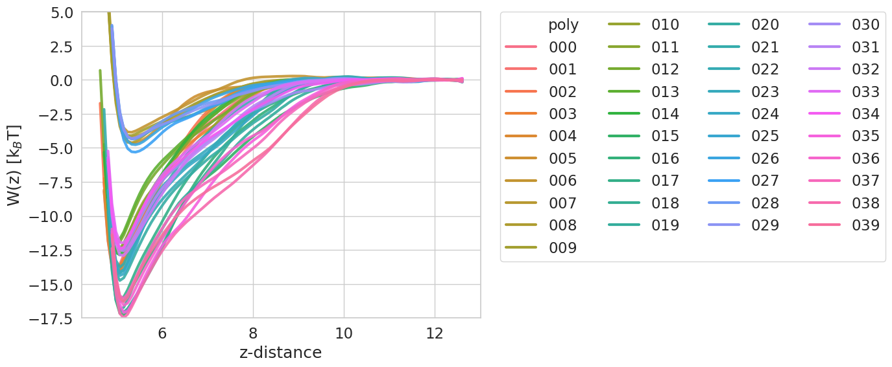

### second virials coefficients

  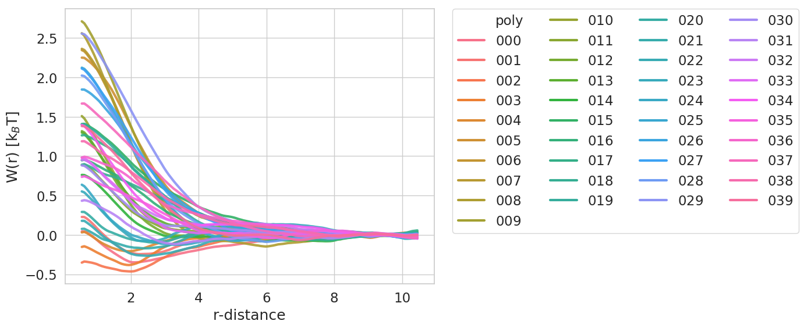

### full factorial

#### adsorption free energies

  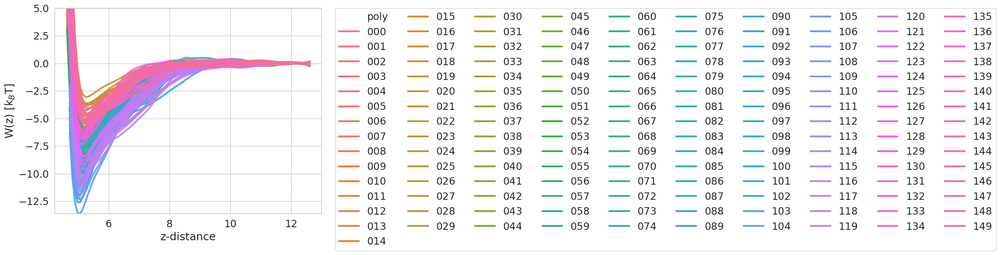

  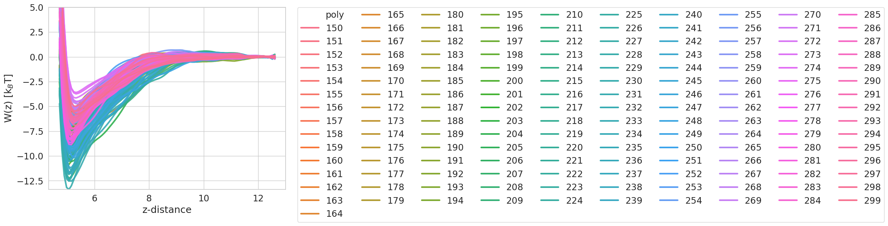

  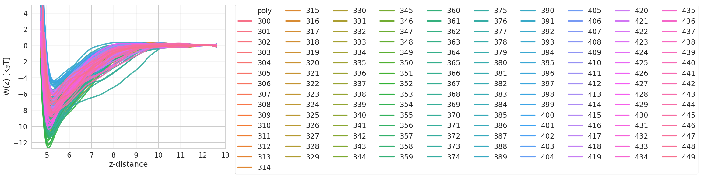

  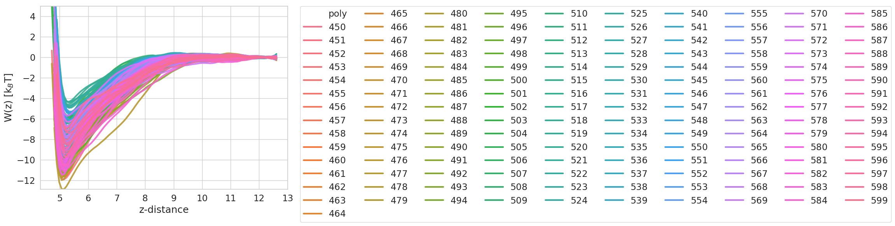

  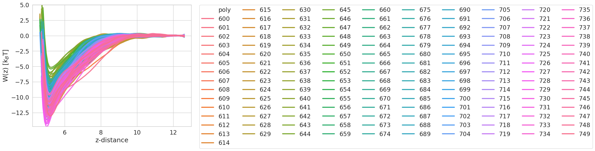

  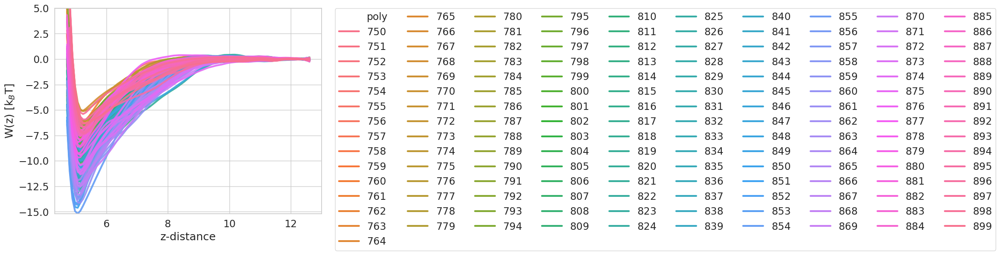

  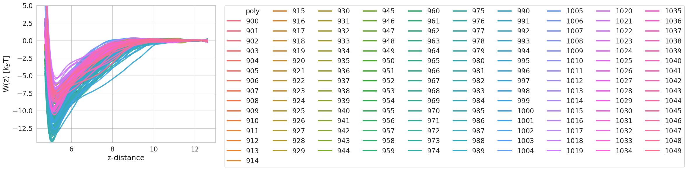

  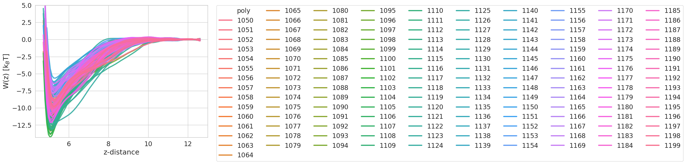

  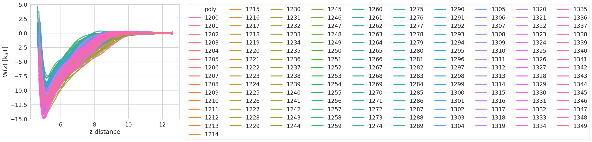

  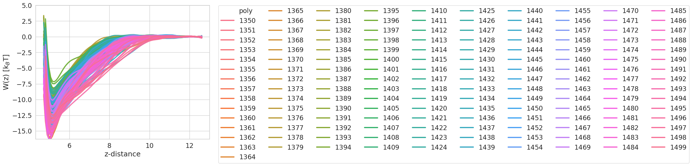

  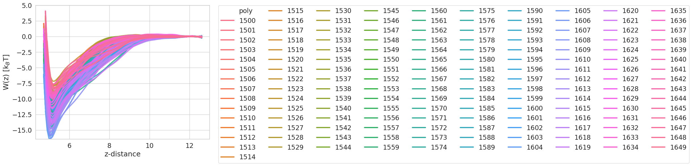

  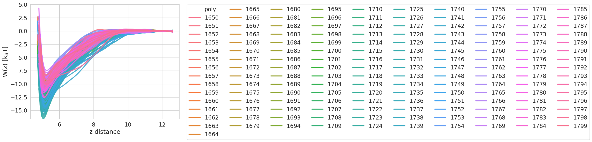

  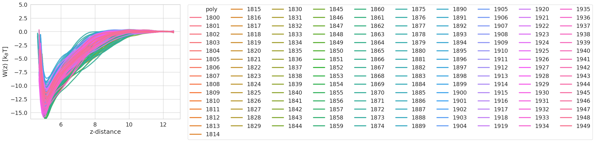

  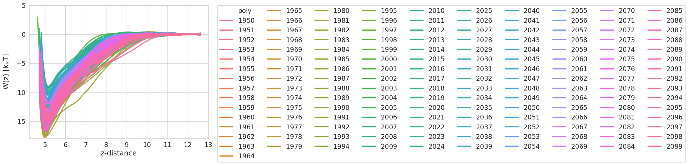

  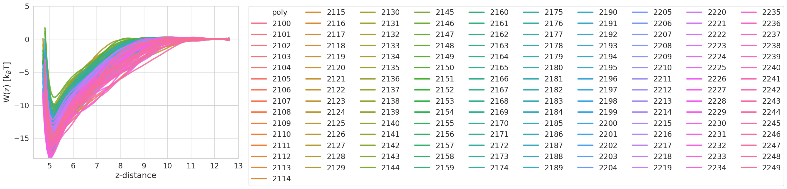

  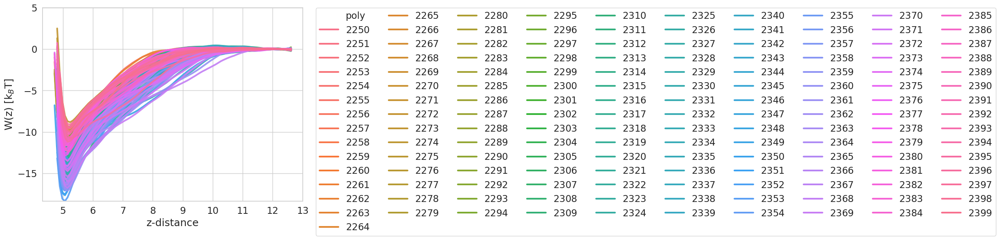

  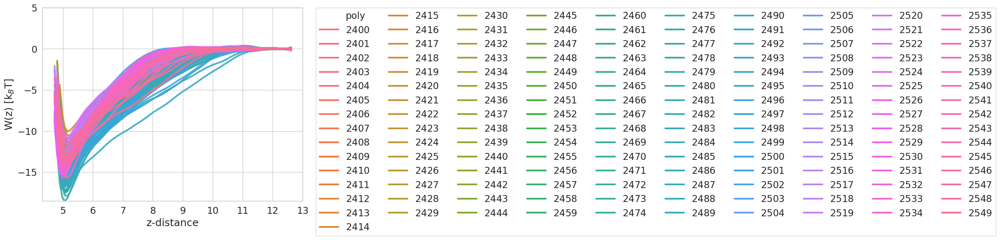

  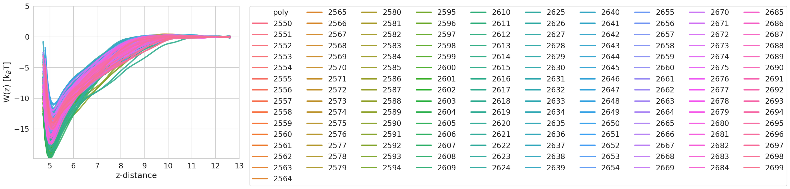

  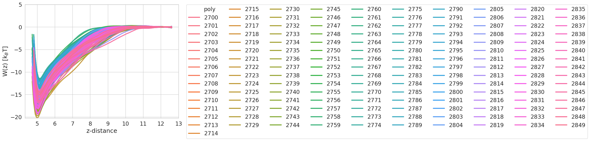

  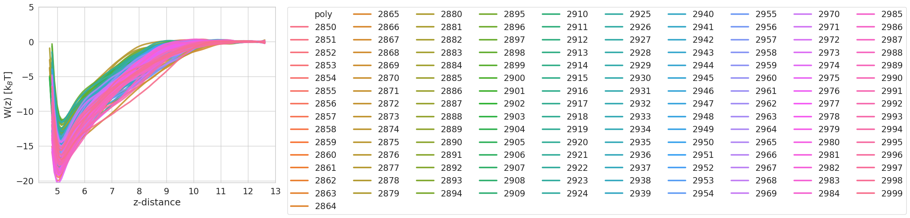

  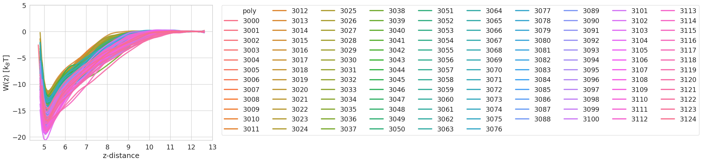

#### second virial coefficients

  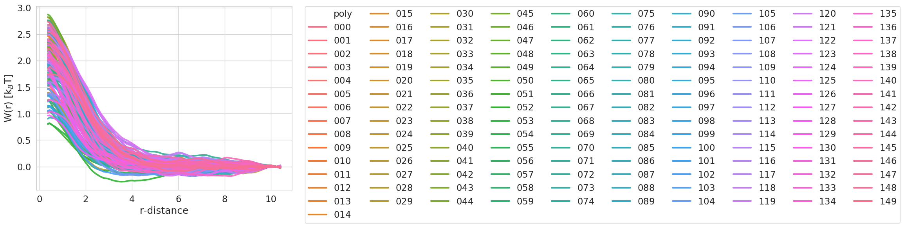

  

  

  

  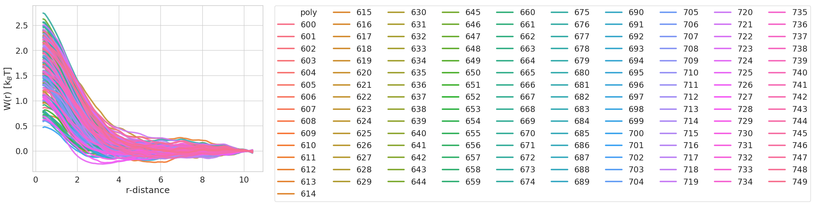

  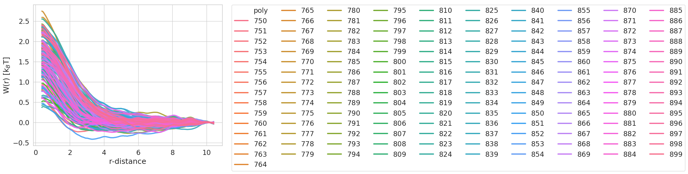

  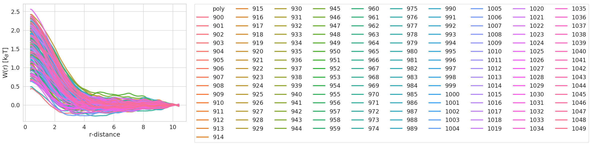

  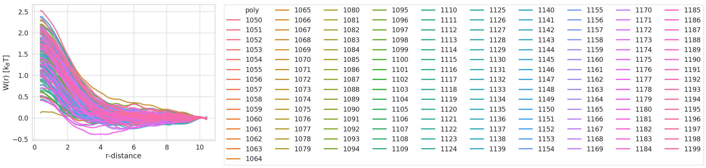

  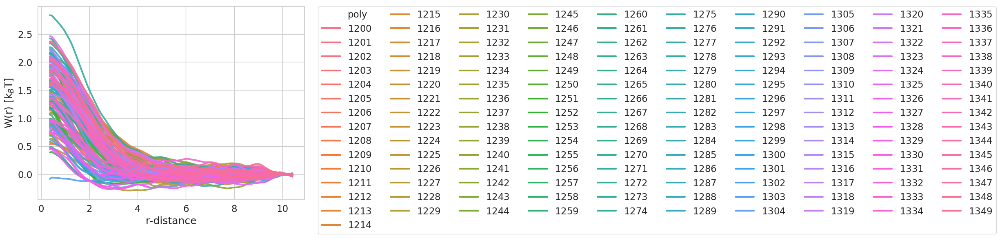

  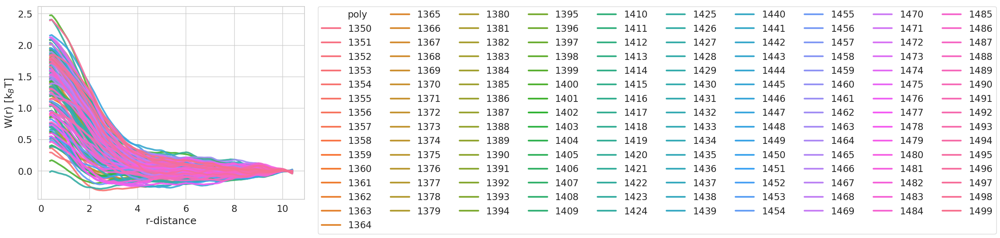

  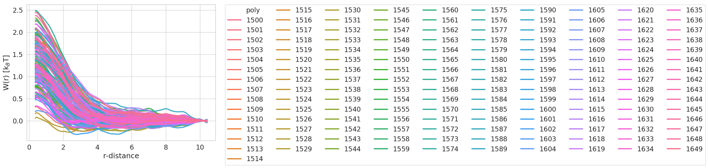

  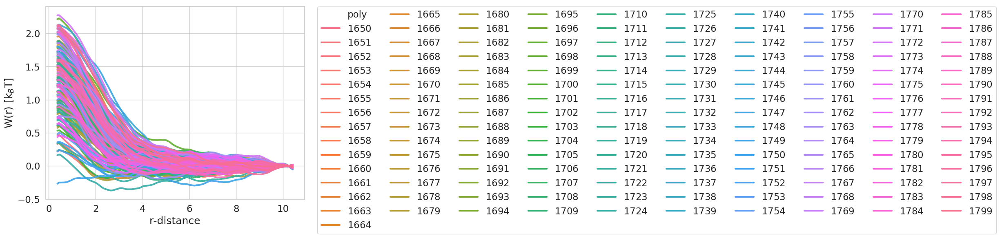

  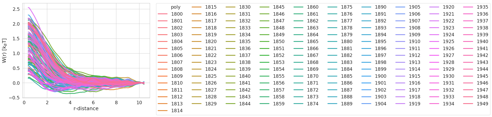

  

  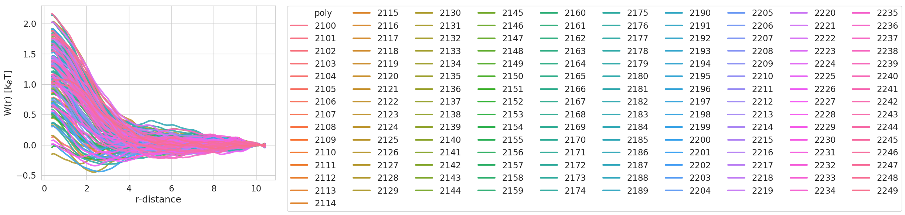

  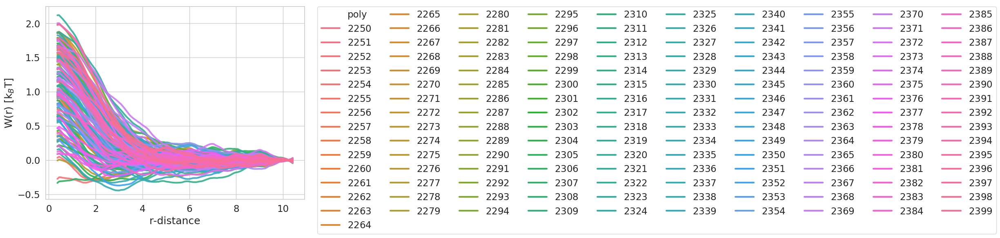

  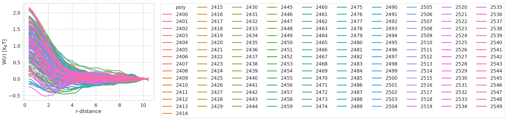

  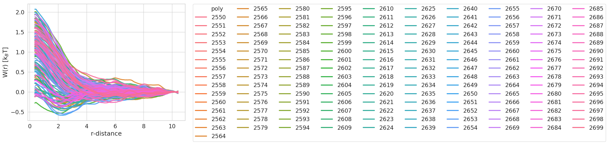

  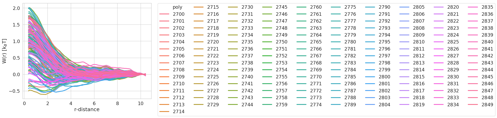

  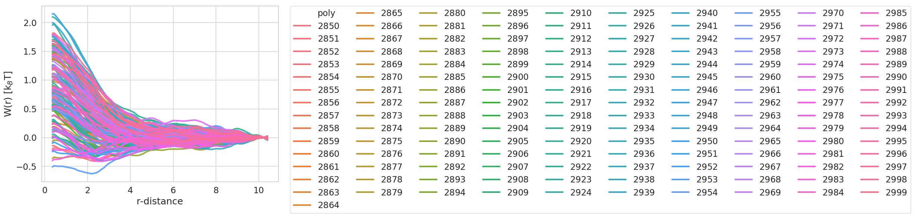

  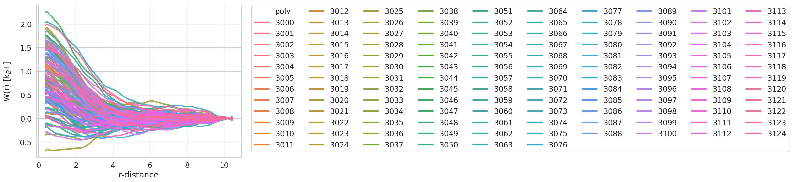

